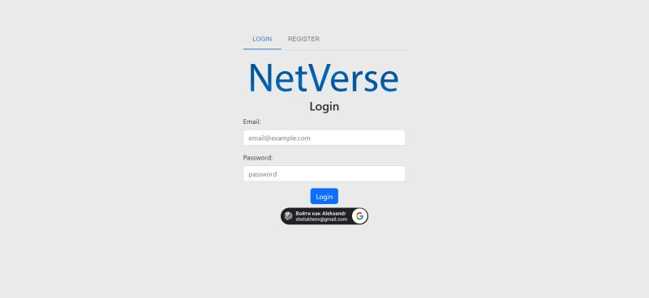
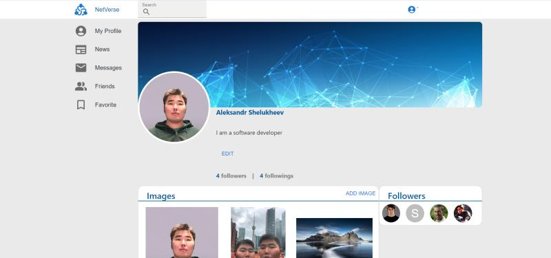
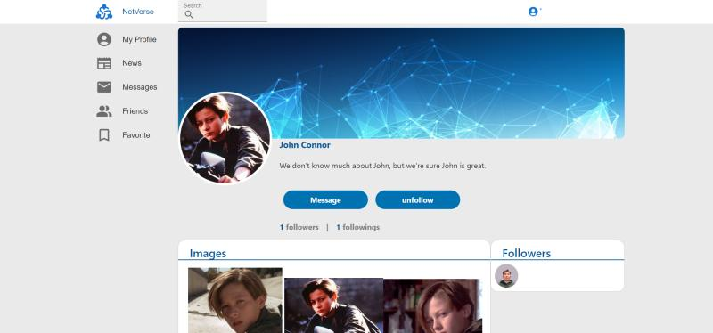
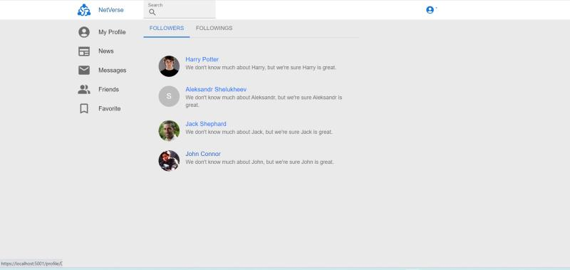
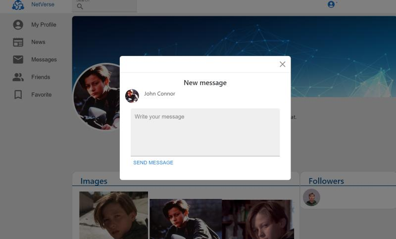

# social-media

# Social App

A full-stack social media application built with **ASP.NET Core (C#)** on the backend and **React + TypeScript** on the frontend. Users can register, log in, create posts, like and follow others, send messages, and more.

<!-- ## 🌐 Live Demo

🚀 [Check it out here](https://your-deployment-link.com) *(Add this after deployment)* -->

## 🛠️ Tech Stack

### Frontend
- React
- TypeScript
- Axios
- React Router
- Redux
- CSS Modules / Styled Components

### Backend
- ASP.NET Core Web API
- Entity Framework Core
- PostgreSQL / SQL Server (mention which one)
- JWT Authentication
- AutoMapper
- Swagger (if included)

## 🔑 Features

- User authentication (register/login with JWT)
- User profiles with avatars
- Create/edit/delete posts
- Like and follow other users
- Direct messaging
- Responsive UI

## 🖼️ Screenshots

### 🔹 Homepage


### 🔹 Profile Page



### 🔹 Messages


### 🔹 Create Post


## ⚙️ Installation

### Prerequisites
- [.NET 7 SDK](https://dotnet.microsoft.com/)
- [Node.js](https://nodejs.org/)
- PostgreSQL / SQL Server running locally

### Backend Setup

```bash
cd backend
dotnet restore
dotnet ef database update
dotnet run
